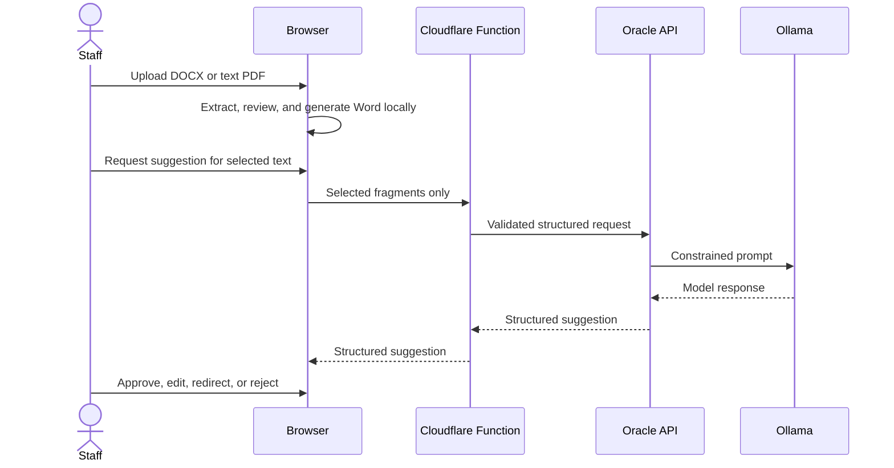

# CV Builda architecture

Status labels below distinguish source-code evidence from runtime verification.

| Component | State | Evidence and boundary |
|---|---|---|
| Marketing route `/` and builder route `/cv-builda` | Implemented | Vite/React route shell; direct-host fallback still needs preview verification. |
| Browser extraction and review | Implemented | DOCX/PDF extraction, draft model and source ledger run in the browser. |
| In-memory working state | Implemented | React reducer state; no candidate database or saved drafts are designed. Browser inspection remains a release check. |
| Approved view model, preview and DOCX | Implemented | One approved view model feeds preview and both template choices. Word desktop rendering needs manual acceptance. |
| Cloudflare Pages relay | Implemented | Function validates requests and relays selected fragments. Preview configuration needs verification. |
| Oracle FastAPI and Ollama | Implemented in source; needs deployment verification | Stateless API calls Ollama. Neither service should have a public container port. |

AI is optional. Failure of the relay, API, or Ollama must not prevent manual review and DOCX export. There is no authentication for the public builder, candidate persistence, OCR, PDF export, analytics, or CRM integration.

The original upload is intended to remain in the browser. Only staff-selected text required for a suggestion transits Cloudflare and Oracle transiently; this flow is not “fully local.” Human approval is the content-control boundary.
